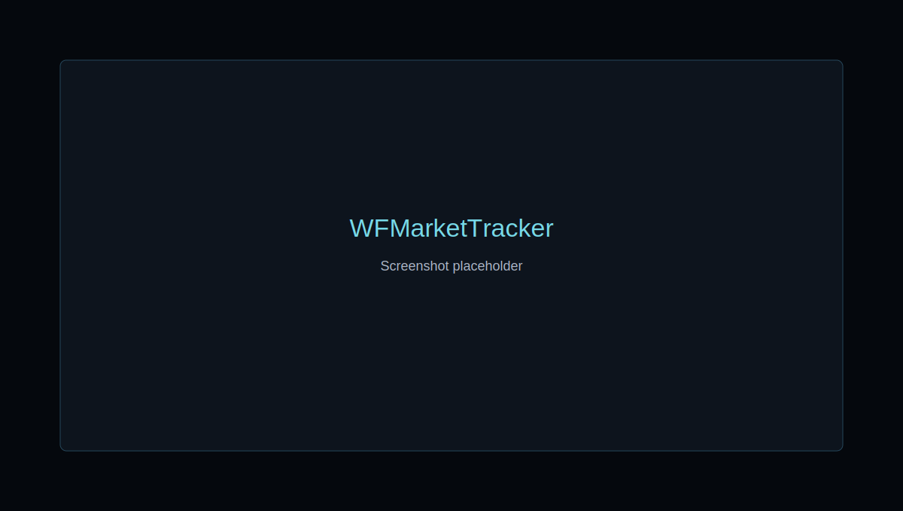

# Warframe Price Viewer

Modern dark UI for quickly checking Warframe item prices from the public warframe.market API.



## Features

- Fast item search with autocomplete, debounce, keyboard navigation, English/localized names, and fuzzy typo tolerance.
- Current sell/buy order view with minimum sell, maximum buy, spread, spread percent, median sell price, quantities, ranks, platforms, Cross Play, seller status, and update timestamps.
- Filters for order type, user status, rank, quantity, platform, Cross Play, and platinum range.
- Local favorites and recently viewed items persisted in `localStorage`.
- Manual refresh, stale-data indication, offline/API/rate-limit/error states, and non-aggressive auto-refresh.
- Runtime API validation with Zod and normalized internal models.

## Stack

- Vite, React, TypeScript
- TanStack Query for request caching, dedupe, stale data, retry/backoff
- Zustand for favorites, recent items, and preferences
- Zod for runtime validation
- Fuse.js for fuzzy local search
- Vitest, Testing Library, MSW, Playwright

## Requirements

- Node.js 22+
- npm 11+

## Setup

```bash
npm install
cp .env.example .env.local
npm run dev
```

The default API base is `/api/wfm`, proxied by Vite to `https://api.warframe.market/v2` during local development and preview.

## Scripts

```bash
npm run dev
npm run typecheck
npm run lint
npm run test
npm run test:integration
npm run test:e2e
npm run build
```

## Environment

See [.env.example](/Users/ali/Desktop/warframe/warframe-price-viewer/.env.example).

- `VITE_WARFRAME_MARKET_API_BASE_URL`: API base URL. Defaults to `/api/wfm` for the Vite proxy.
- `VITE_WARFRAME_MARKET_ASSET_BASE_URL`: base URL for images.
- `VITE_WARFRAME_MARKET_LANGUAGE`: preferred language, default `en`.
- `VITE_WARFRAME_MARKET_PLATFORM`: default platform, default `pc`.
- `VITE_WARFRAME_MARKET_CROSSPLAY`: default Cross Play visibility, default `true`.

Never commit a real `.env`.

## API Endpoints

The app uses:

- `GET /items`
- `GET /items/{slug}`
- `GET /orders/item/{slug}/top`
- `GET /orders/item/{slug}`

Important notes and API limitations are documented in [docs/api-research.md](/Users/ali/Desktop/warframe/warframe-price-viewer/docs/api-research.md).

## Caching

- Item manifest: `staleTime` 12 hours, `gcTime` 7 days.
- Item detail: `staleTime` 12 hours.
- Top orders: `staleTime` 60 seconds, background refresh every 5 minutes while online.
- Full order list: fetched on demand for filters, `staleTime` 60 seconds.
- Favorites and recent items persist in local storage.

## Project Structure

```text
src/api        API client, schemas, normalized errors
src/domain     app models, transforms, market math
src/features   search, market view, favorites, recents
src/lib        config, hooks, storage, formatting
src/test       test setup and fixtures
tests/e2e      Playwright scenarios
docs           API research and architecture
```

## Known API Caveats

- The older public OpenAPI mirror still describes `v1`, while the current warframe.market frontend uses `v2`.
- `v1` routes tested on 2026-07-12 returned `Deprecated`, 404, or inconsistent responses for public order use.
- Public browsing does not need authentication.
- ToS says listing requests must not exceed 3 requests per second and contracts 10 per minute.
- Riven details are exposed through auction endpoints, not ordinary item order endpoints; the MVP documents this and avoids fake riven fields.

## Roadmap

- Add richer statistics charts once `v2` statistics behavior is documented.
- Add auction/riven exploration as a separate module.
- Add deploy pipeline and production monitoring.
- Add a production rewrite/proxy for `/api/wfm` when deploying to static hosting.
